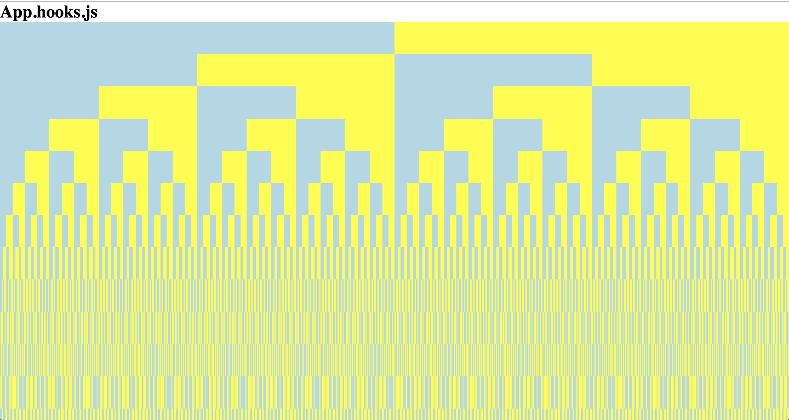
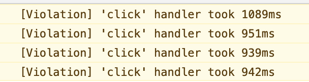
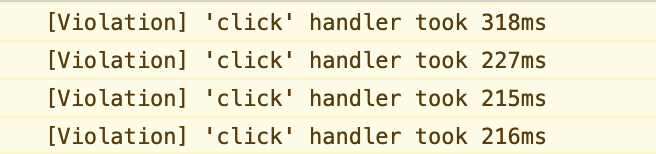

## Hooks performance test

Here is an example of how hooks can cause performance problems.

This demo was modelled off a real world performance issue I was tasked to solve where we had special URL qualification logic that took a long time as our app was writing out special hrefs to link tags.

## Run as hook

```
yarn start-hooks
```



Click on a blue square. Eventually the yellow square should turn white.

Notice clicks take roughly 940-1090ms to propagate



## Run as class

```
yarn start-class
```

Click on a blue square

Notice clicks take roughly 220-320ms to propagate



## What's the difference?

Basically hooks are slower because they break the `React.memo()` cache on downstream components by recreating callbacks when the state changes.

Our hooks App implementation works like so:

```js
function App() {
  const [isYellow, setIsYellow] = useState(true);

  const handleClick = useCallback(() => {
    setIsYellow(!isYellow);
  }, [isYellow]);

  return (
    <>
      <h1>App.hooks.js</h1>
      <Box isYellow={isYellow} depth={12} onClick={handleClick} />
    </>
  );
}
```

Our class implementation works like so:

```js
class App extends React.Component {
  constructor(props) {
    super(props);
    this.state = {
      isYellow: true
    };
  }

  handleClick = () => {
    this.setState(({ isYellow }) => ({
      isYellow: !isYellow
    }));
  };

  render() {
    const isYellow = this.state.isYellow;
    const handleClick = this.handleClick;
    return (
      <>
        <h1>App.class.js</h1>
        <Box isYellow={isYellow} depth={12} onClick={handleClick} />
      </>
    );
  }
}
```

The other components in the tree remain the same.
